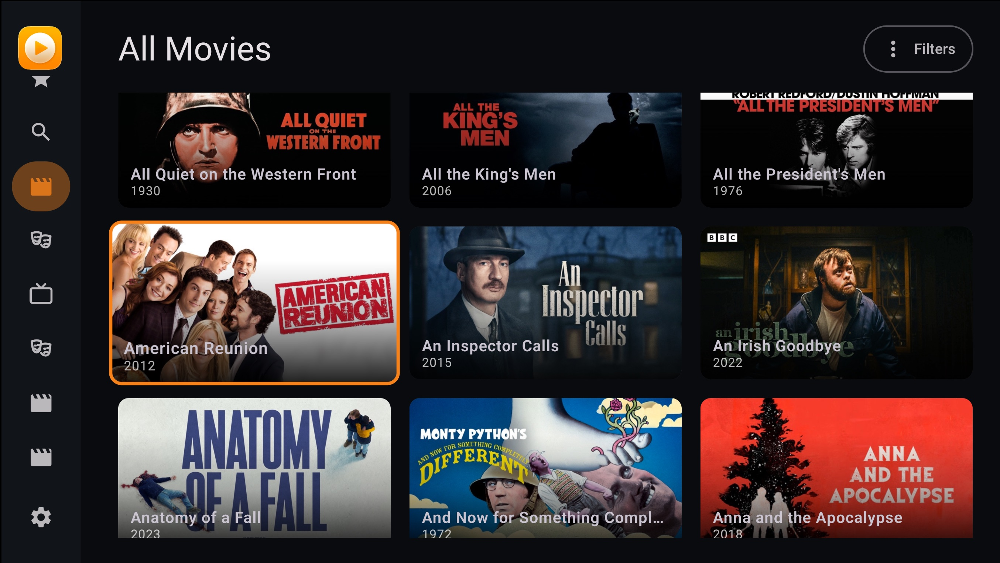

# MyMedia for Android TV

MyMedia for Android TV brings your personal movie and TV show library to the big screen. Use your TV remote to browse your collection, search titles, explore genres and details, and pick up unwatched movies or episodes. The app connects to your [MyMedia server](https://github.com/photangralenphie/MyMedia) over your network to load your library and stream video. You can also download movies, episodes, and TV shows to watch offline, then play saved videos even when the server is unavailable. Set the server address and port in the app to get started.

## Requirements

- An Android TV or Google TV device running Android 8.0 (API 26) or later.
- A reachable MyMedia server. The TV and server must be able to communicate over the network; they do not have to be on the same local network if routing is configured.

To build the app from source, use Android Studio with support for Android Gradle Plugin 9.3.0, Gradle 9.5.0, and JDK 17. The included Gradle wrapper downloads the required Gradle version.

## AI Disclosure

My programming background is in Swift and SwiftUI, and I had no prior experience building Android apps. All of the code in this app was written by AI based on my instructions for the UI and architecture. I have not independently reviewed the code.

## Installation

1. Download [MyMedia.apk from the latest release](https://github.com/photangralenphie/MyMediaAndroidTV/releases/latest/download/MyMedia.apk).
2. Transfer the APK to your Android TV, or download it directly on the device.
3. If prompted, allow your browser or file manager to install unknown apps. This permission is configured per app on Android 8.0 and later.
4. Open `MyMedia.apk` and follow the installation prompts.
5. Open MyMedia and enter the address and port of your MyMedia server in Settings.

## Run from Android Studio

1. Open this project in Android Studio and allow Gradle to sync.
2. Run the `app` configuration on an Android TV or Google TV device running Android 8.0 (API 26) or later.
3. Enter the address and port of the machine hosting your MyMedia server.

## License

This project is licensed under the [MIT License](LICENSE).
